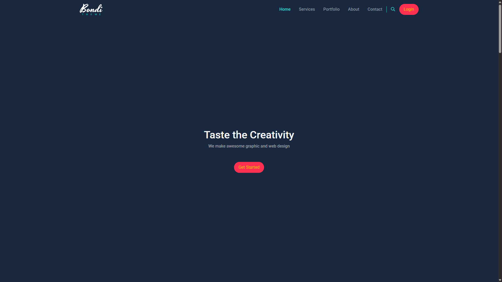
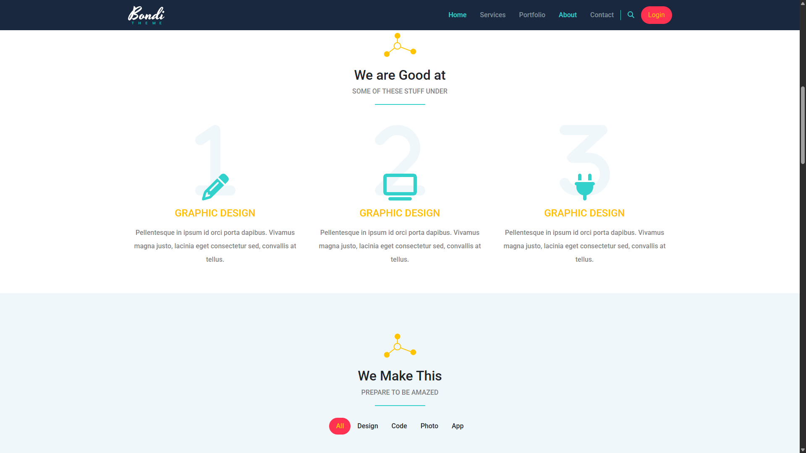
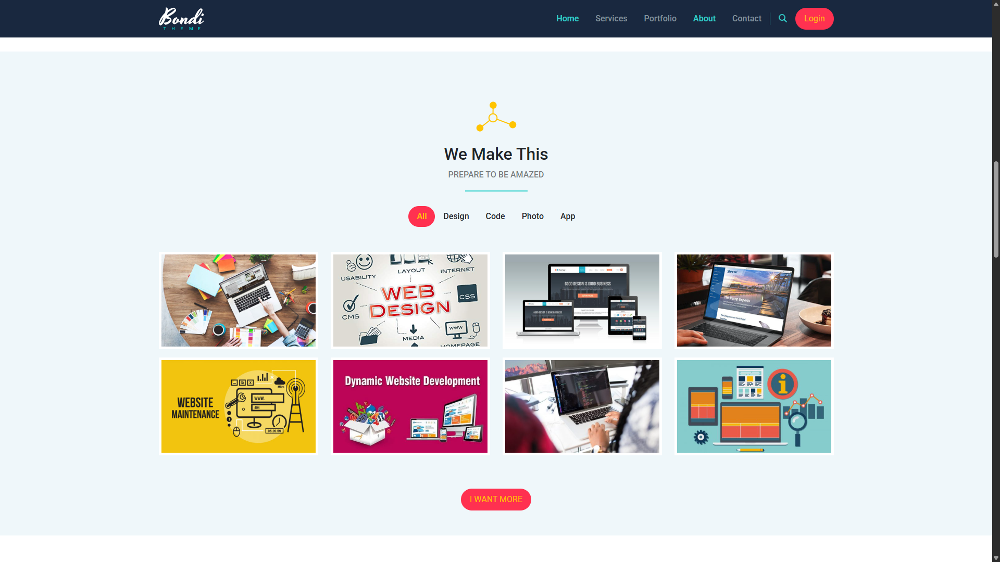
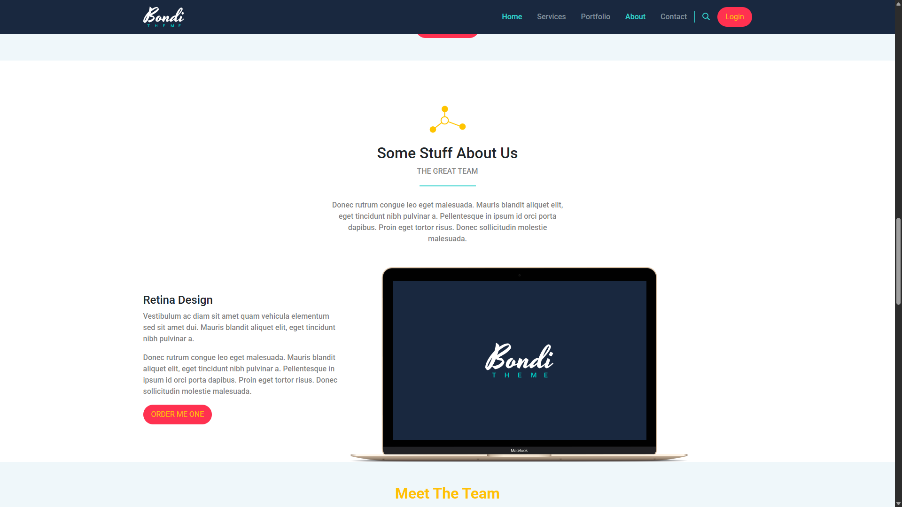
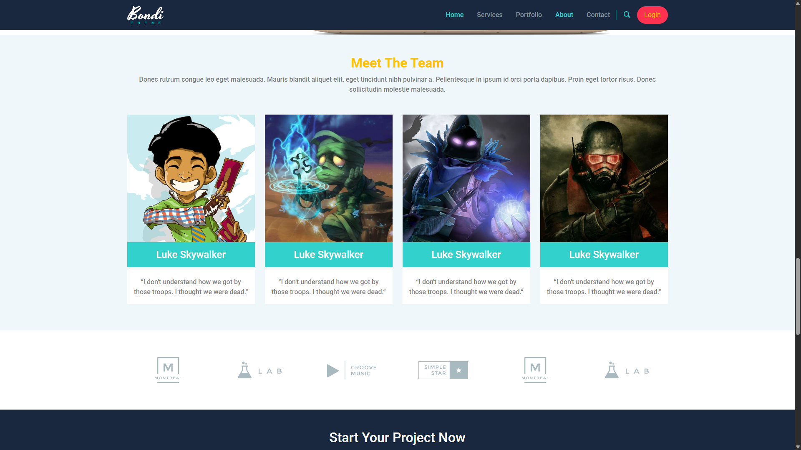
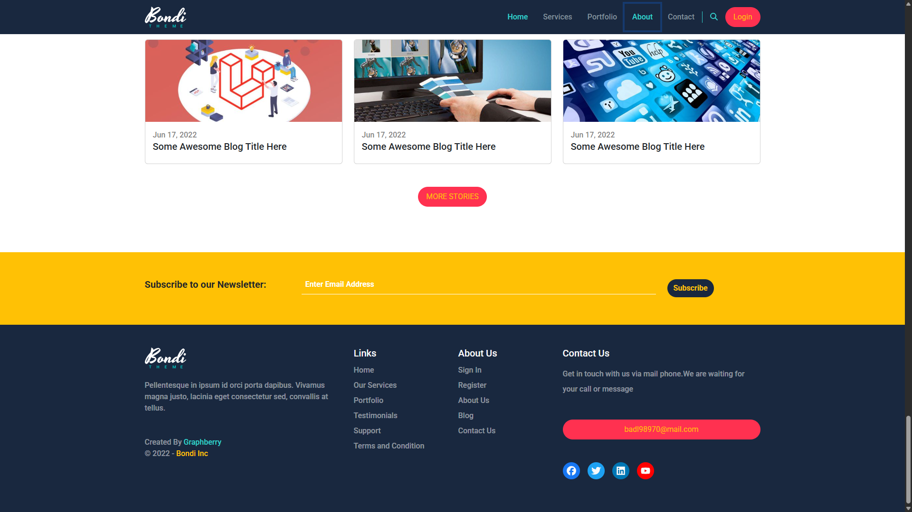

# 🌐 Bondi Landing Page

A modern and responsive landing page built with **HTML5**, **CSS3**, and **Bootstrap 5**.  
This project showcases a clean and professional UI/UX design suitable for digital agencies, startups, or personal portfolios.

---

## 🚀 Live Demo

📍 [View Live](https://codebyabdo.github.io/bondi/)

---

## 📸 Screenshot

 <!-- Add your actual screenshot if available -->
 <!-- Add your actual screenshot if available -->
 <!-- Add your actual screenshot if available -->
 <!-- Add your actual screenshot if available -->
 <!-- Add your actual screenshot if available -->
 <!-- Add your actual screenshot if available -->

---

## ✨ Features

- 📱 Fully responsive using **Bootstrap Grid System**
- 🧭 Sticky navigation bar
- 🖼️ Hero section with CTA
- 💼 Services & Portfolio sections
- ⭐ Testimonials section
- 📩 Contact section
- 🌙 Dark footer layout

---

## 🛠 Tech Stack

- **HTML5**
- **CSS3**
- **Bootstrap 5**

> 💡 No custom JavaScript – 100% static and lightweight

---

## 📦 Getting Started

To run the project locally:

```bash
git clone https://github.com/abd-el-rahman-adel-dev/bondi.git
cd bondi
open index.html
```

Or just double-click `index.html` in your file manager.

---

## 📁 Project Structure

```
📦 bondi
┣ 📂 css
┃ ┗ 📜 style.css
┣ 📂 images
┣ 📂 fonts
┣ 📜 index.html
```

---

## 📄 License

This project is licensed under the [MIT License](./LICENSE).

---

## 🙋‍♂️ Author

- [Abd El-Rahman Adel](https://github.com/codebyabdo)
- [LinkedIn](https://www.linkedin.com/in/codebyabdo)

---

> ⭐ If you like this landing page, consider starring the repo and reusing the template for your own projects.
